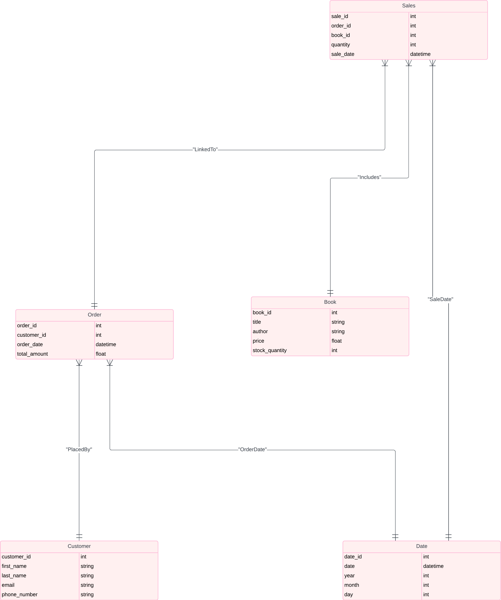
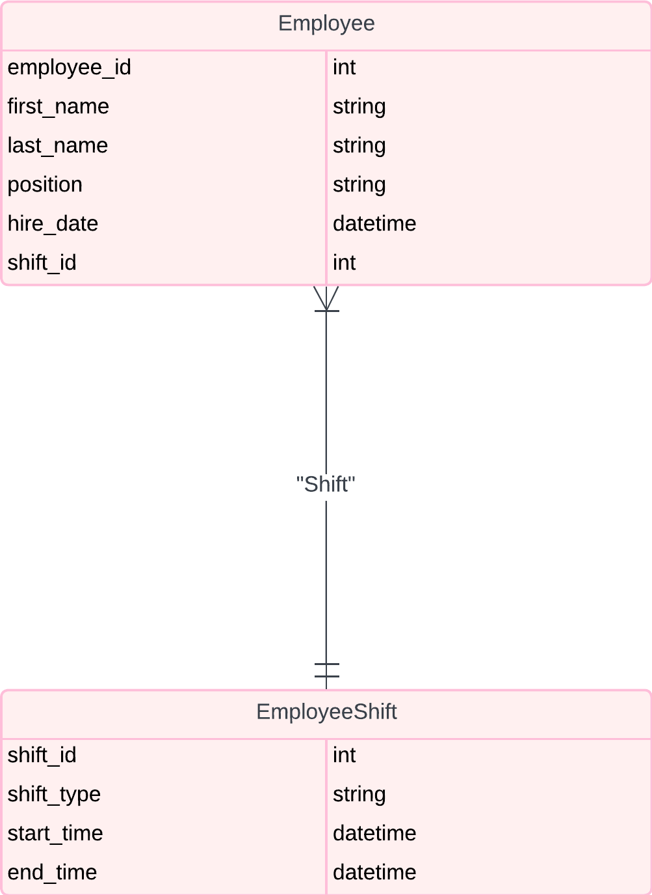

# Assignment 1: Design a Logical Model

## Question 1
Create a logical model for a small bookstore. 📚

At the minimum it should have employee, order, sales, customer, and book entities (tables). Determine sensible column and table design based on what you know about these concepts. Keep it simple, but work out sensible relationships to keep tables reasonably sized. Include a date table. There are several tools online you can use, I'd recommend [_Draw.io_](https://www.drawio.com/) or [_LucidChart_](https://www.lucidchart.com/pages/).

### My Answer (Question 1):
**Tables and Columns**

**Employee Table <br>**
Columns:
* employee_id (Primary Key)
* first_name
*   last_name
*   position
*   hiire_date
*   shift_id (Foreign Key referencing shift_id in the Employee Shift table)

**Order Table <br>**
Columns:
* order_id (Primary Key)
* customer_id (Foreign Key referencing customer_id in the Customer table)
* order_date (Foreign Key referencing date_id in the Date table)
* Total_amount
* Sales Table
* Columns:
* sale_id (Primary Key)
* order_id (Foreign Key referencing order_id in the Order table)
* book_id (Foreign Key referencing book_id in the Book table)
* quantity
* sale_date (Foreign Key referencing date_id in the Date table)

**Customer Table <br>**
Columns:
* customer_id (Primary Key)
* first_name
* last_name
* email
* phone_number
* Book Table
* Columns:
* book_id (Primary Key)
* Title
* Author
* Price
* Stock_quantity
* Date Table
* Columns:
* date_id (Primary Key)
* date
* year
* month
* day

**Employee Shift Table <br>**
Columns:
* shift_id (Primary Key)
* shift_type (e.g., 'Morning', 'Evening')
* start_time
* end_time

**Relationships <br>**
* Employee-Shift Relationship: Each employee is assigned to a shift.
  * Employee.shift_id references EmployeeShift.shift_id
* Order-Customer Relationship: Each order is placed by a customer.
  * Order.customer_id references Customer.customer_id
* Order-Date Relationship: Each order has a date associated with it.
  * Order.order_date references Date.date_id
* Sales-Order Relationship: Each sale is linked to an order.
  * Sales.order_id references Order.order_id
* Sales-Book Relationship: Each sale includes a book.
  * Sales.book_id references Book.book_id
* Sales-Date Relationship: Each sale has a date associated with it.
  * Sales.sale_date references Date.date_id
 
**UML Design:**



## Question 2
We want to create employee shifts, splitting up the day into morning and evening. Add this to the ERD.

### My Answer


## Question 3
The store wants to keep customer addresses. Propose two architectures for the CUSTOMER_ADDRESS table, one that will retain changes, and another that will overwrite. Which is type 1, which is type 2?

_Hint, search type 1 vs type 2 slowly changing dimensions._

Bonus: Are there privacy implications to this, why or why not?
```
Customer Addresses Table
Columns:
* customer_address_id (Primary Key)
* customer_id (Foreign Key referencing customer_id in the Customer table)
* address
* city
* state
* zip_code
* valid_from_date
* valid_to_date

Labeling:
* Architecture 1 (Retain Changes): Type 1 SCD
* Architecture 2 (Overwrite Changes): Type 2 SCD

Evaluation:
* Both Correct (Complete): Both architectures are correctly labeled as Type 1 and Type 2 SCD, respectively.
* One Wrong (Incomplete): One architecture is correctly labeled, while the other is mislabeled.
* Both Wrong (Incomplete): Both architectures are mislabeled.

Reflection:
* Designing two distinct architectures for handling changes to customer addresses allows for flexibility in data management strategies. Type 1 SCD retains simplicity by updating existing records, while Type 2 SCD preserves historical data by creating new records for each change. Each approach has its advantages and trade-offs, depending on the specific requirements and business needs.

Further explanation:
* SCD stands for Slowly Changing Dimension. It's a concept commonly used in data warehousing and database management to describe how dimensions (attributes of interest, such as customer information or product details) change over time. SCDs are particularly relevant in scenarios where historical data needs to be preserved and analyzed, such as in tracking changes to customer addresses or product prices.
There are different types of Slowly Changing Dimensions, each describing a different method for handling changes to dimension data over time. The most common types are:

* Type 1 SCD: In this approach, changes to dimension data are simply overwritten with the new values. Historical data is not preserved. This method is suitable when historical data is not important or when storage space is limited.
Type 2 SCD: With Type 2 SCD, a new record is created whenever there is a change to dimension data. This allows for historical tracking, as each record contains its validity period. It's useful when maintaining a complete history of changes is necessary for analysis and reporting.
Type 3 SCD: This approach involves maintaining both the current and previous values of selected attributes within the same record. It's a compromise between Type 1 and Type 2, offering some historical tracking while minimizing storage requirements.

* Type 4 SCD: Also known as "history preserving," Type 4 SCD uses a separate history table to store all changes to dimension data, while the main table maintains only the current data. This approach is useful when you want to preserve historical data without cluttering the main table.

* Type 6 SCD: This type combines aspects of Type 1 and Type 2 SCDs, using a flag or separate fields to indicate changes while also maintaining historical records. It's a flexible approach that allows for various levels of historical tracking.

The appropriate type of SCD depends on factors such as the importance of historical data, storage considerations, and analytical requirements. Each type has its advantages and trade-offs, and the choice often depends on the specific needs of the organization or project.

```

## Question 4
Review the AdventureWorks Schema [here](https://i.stack.imgur.com/LMu4W.gif)

Highlight at least two differences between it and your ERD. Would you change anything in yours?
```
Differences between Participant ERDs and AdventureWorks ERDs:

Column Naming Conventions:
* My ERD: Might use camelCase or inconsistent naming conventions.
AdventureWorks ERD: Uses consistent naming conventions, usually snake_case, and descriptive names.

* Normalization Level:
My ERD: May not fully adhere to normalization rules, potentially leading to redundancy.
AdventureWorks ERD: Typically follows strict normalization rules to eliminate redundancy and ensure data integrity.

* My Reflection on Differences:
Naming Conventions: Consistent naming conventions in AdventureWorks ERD make the schema easier to read and maintain. Adopting a similar approach in our design can improve clarity and reduce errors.
Normalization: Following strict normalization as seen in AdventureWorks can help avoid data anomalies and ensure efficient data updates. Reflecting on our design, we should ensure that our tables are normalized to at least the third normal form (3NF) to maintain data integrity.

* Summary:
This logical model design provides a clear and organized structure for managing bookstore administration. It includes all required tables with relevant columns and establishes clear relationships between them. By comparing and reflecting on the differences between our design and a well-established schema like AdventureWorks, we can identify areas for improvement and ensure our design is robust and efficient.
```

# Criteria

[Assignment Rubric](./assignment_rubric.md)

# Submission Information

🚨 **Please review our [Assignment Submission Guide](https://github.com/UofT-DSI/onboarding/blob/main/onboarding_documents/submissions.md)** 🚨 for detailed instructions on how to format, branch, and submit your work. Following these guidelines is crucial for your submissions to be evaluated correctly.

### Submission Parameters:
* Submission Due Date: `June 1, 2024`
* The branch name for your repo should be: `model-design`
* What to submit for this assignment:
    * This markdown (design_a_logical_model.md) should be populated.
    * Two Entity-Relationship Diagrams (preferably in a pdf, jpeg, png format).
* What the pull request link should look like for this assignment: `https://github.com/<your_github_username>/sql/pull/<pr_id>`
    * Open a private window in your browser. Copy and paste the link to your pull request into the address bar. Make sure you can see your pull request properly. This helps the technical facilitator and learning support staff review your submission easily.

Checklist:
- [ ] Create a branch called `model-design`.
- [ ] Ensure that the repository is public.
- [ ] Review [the PR description guidelines](https://github.com/UofT-DSI/onboarding/blob/main/onboarding_documents/submissions.md#guidelines-for-pull-request-descriptions) and adhere to them.
- [ ] Verify that the link is accessible in a private browser window.

If you encounter any difficulties or have questions, please don't hesitate to reach out to our team via our Slack at `#cohort-3-help`. Our Technical Facilitators and Learning Support staff are here to help you navigate any challenges.
